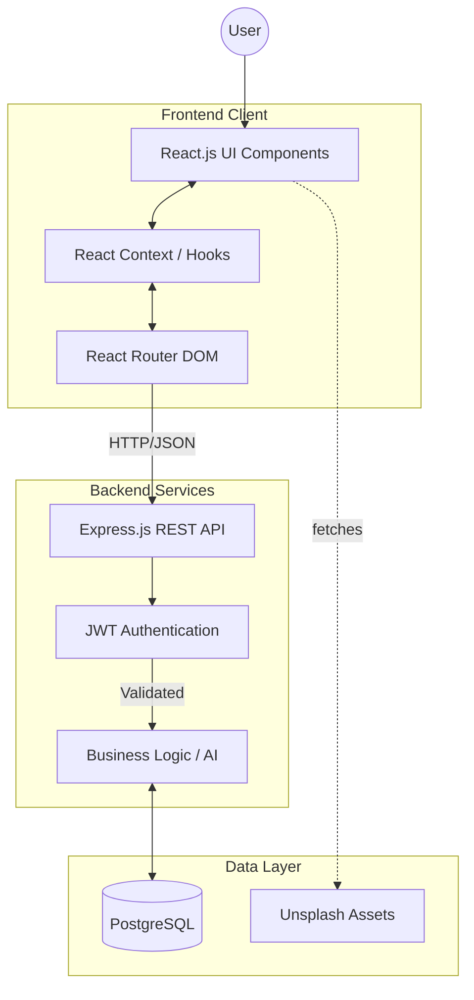
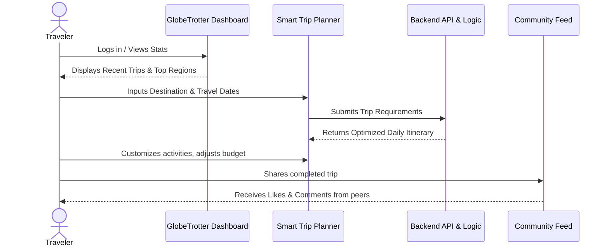

<div align="center">
  
  
  <br/>
  
  # 🌍 GlobeTrotter 
  ### *Adaptive AI Travel Planner — Hackathon MVP Edition*
  
  [](https://reactjs.org/)
  [](https://nodejs.org/)
  [](https://postgresql.org/)
  [](https://tailwindcss.com/)
</div>

---

## 💡 The Vision

Travel planning shouldn't feel like a spreadsheet exercise. **GlobeTrotter** is a next-generation travel platform built to instantly design, customize, and share incredible journeys. From smart daily itineraries and budget tracking to community sharing and an embedded AI assistant, GlobeTrotter turns travel anxiety into travel excitement. 

This project was built rapidly as a **Hackathon MVP**, demonstrating full-stack integration, complex state management, and modern UI/UX principles.

---

## ✨ Key Features

- 🗺️ **Smart Trip Planner:** Instantly generate day-by-day itineraries complete with destinations, dates, and calculated travel timelines.
- 💬 **Global AI Chatbot:** A ubiquitous floating travel assistant ready to answer your questions and note your preferences.
- 🌐 **Community Feed:** Share your favorite trips, like other explorers' posts, and comment on global adventures.
- 📊 **Admin Analytics:** Comprehensive dashboard utilizing `recharts` for visualization of user engagement, trip creation, and regional popularity.
- 🔗 **Public Trip Sharing:** Generate unique shareable URLs so your friends and family can view your upcoming itineraries.
- 📅 **Dynamic Calendar & Mapping:** Visualize your journey seamlessly on a monthly calendar or interactive itinerary list.

---

## 🔄 System Architecture

Our platform utilizes a robust full-stack architecture separating the client UI from a secure, stateless backend API.



---

## 🚶 User Workflow

GlobeTrotter is designed for a frictionless user experience. Here is the journey of a typical user from landing to sharing:



---

## 🛠️ Tech Stack

**Frontend:**
*   React 18 (Vite)
*   Tailwind CSS (Styling & Dark Mode)
*   React Router v6 (Navigation)
*   Recharts (Data Visualization)
*   Lucide React (Icons)

**Backend:**
*   Node.js & Express.js
*   PostgreSQL (Relational Database)
*   `pg` (Node Postgres Client)
*   JSON Web Tokens (JWT) & bcrypt (Authentication)

---

## 🚀 Getting Started

To run GlobeTrotter locally on your machine:

### 1. Database Setup (PostgreSQL)
Ensure PostgreSQL is running locally, then create the database and run the migrations:
```bash
createdb globetrotter_db
# Run the schema and feature enhancements
psql -d globetrotter_db -f backend/database/migrations/001_init_schema.sql
psql -d globetrotter_db -f backend/database/migrations/002_feature_enhancements.sql
# Seed the initial mock data
node backend/database/seeds/seed_data.js
```

### 2. Backend Environment
Navigate to the `backend` directory, install dependencies, and start the server:
```bash
cd backend
npm install
# Create a .env file with PORT=5000, DB credentials, and JWT_SECRET
npm run dev
```

### 3. Frontend Environment
Navigate to the `frontend` directory, install dependencies, and start the Vite dev server:
```bash
cd frontend
npm install
npm run dev
```

Your app will be running at `http://localhost:5173`!

---

<div align="center">
  <p>Built with ❤️ for the Hackathon</p>
</div>
